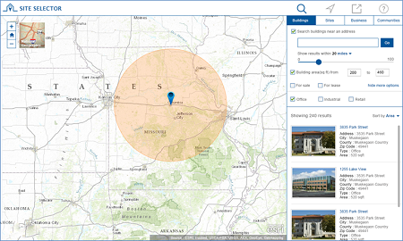

site-selector
==============

The Site Selector application is a configurable JavaScript application that allows interested parties to explore a geography and make a determination about where they want to locate their business.

## Features

* Search for a place by name, by current location, by address
* Review ammenities at a given place, assess demographic  variables 
* Share information via social media

## Instructions

### Esri Sample Services

Esri's sample services can be used with this repository to extend the application.

### General Help
[New to Github? Get started here.](http://htmlpreview.github.com/?https://github.com/Esri/esri.github.com/blob/master/help/esri-getting-to-know-github.html)

## Requirements

### Esri Sample Services

* Microsoft ASP.NET Framework 4.0 available from the [Microsoft website](http://www.microsoft.com/en-us/download/details.aspx?id=17851)

### Your Services

* ArcGIS for Desktop 10.2 - Standard or Advanced - [About](http://www.esri.com/software/arcgis/arcgis-for-desktop)
* ArcGIS for Server 10.2 - Standard or Advanced - [About](http://www.esri.com/software/arcgis/arcgisserver)
* Local Government Information Model for Local Government Implementations - [About](http://www.arcgis.com/home/item.html?id=ae175b36c4154dda987127dff879350d)
* Microsoft ASP.NET Framework 4.0 available from the [Microsoft website](http://www.microsoft.com/en-us/download/details.aspx?id=17851)

## Resources

Learn more about Esri's [ArcGIS for State Government maps and apps](http://solutions.arcgis.com/state-government/).

Show me a list of other [Government GitHub repositories](http://esri.github.io/#Government).

Additional [information and sample data](http://bit.ly/18Jhje3)
are available for the application.

This application uses the 3.8 version of
[Esri's ArcGIS API for JavaScript](http://help.arcgis.com/en/webapi/javascript/arcgis/);
see the site for concepts, samples, and a reference for using the API to create mapping web sites.

## Issues

Find a bug or want to request a new feature?  Please let us know by submitting an issue.

## Contributing

Esri welcomes contributions from anyone and everyone.
Please see our [guidelines for contributing](https://github.com/esri/contributing).

## Licensing

Copyright 2013 Esri

Licensed under the Apache License, Version 2.0 (the "License");
you may not use this file except in compliance with the License.
You may obtain a copy of the License at

   http://www.apache.org/licenses/LICENSE-2.0

Unless required by applicable law or agreed to in writing, software
distributed under the License is distributed on an "AS IS" BASIS,
WITHOUT WARRANTIES OR CONDITIONS OF ANY KIND, either express or implied.
See the License for the specific language governing permissions and
limitations under the License.

A copy of the license is available in the repository's
[LICENSE.txt](https://raw.github.com/Esri/configurable-place-finder/master/LICENSE.txt) file.

